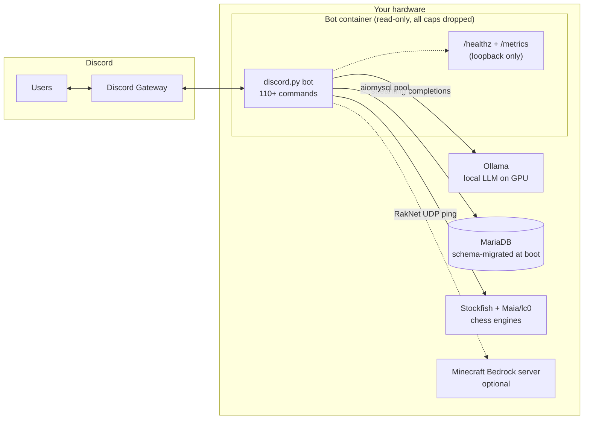
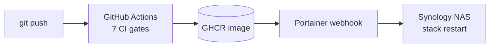

# discord-ollama-bot, a self-hosted AI Discord bot

[](https://github.com/johnhh2/discord-ollama-bot/actions/workflows/ci.yml)
[](https://www.python.org/downloads/)
[](https://github.com/Rapptz/discord.py)
[](docker-compose.yml)
[](LICENSE)

A Discord bot that runs entirely on your own hardware: chat with a local [Ollama](https://ollama.com) LLM (no API keys, no per-token costs, no data leaving your network), plus a full virtual economy, casino games, a chess engine that plays like a human, a shop that spends coins on real Discord effects, and a tiered permission system. Backed by MariaDB, deployed with Docker.

**110+ commands · 2,250+ tests · more test code than source code · zero external AI services**

<!-- TODO: demo GIF or screenshot here. A short clip of !ask streaming + a !slots spin sells this better than any text. -->

## Why this exists

Most AI Discord bots are thin wrappers around a paid API. This one talks to an Ollama instance on your LAN, streams responses as they generate, and throttles concurrent generations with a global semaphore so one GPU can serve a whole server. Everything else (the economy, games, and moderation) works even when the LLM is down, since the health endpoint reports "degraded", not dead.

## How it runs



## Features

### 🤖 LLM chat, locally hosted
- `!ask`: conversational Q&A; each conversation gets its own thread with isolated context
- `!continue`, `!tldr`, `!story`, `!roleplay`: follow-ups, summarization, and persona modes
- Per-guild model selection, with separate models per mode (`!model`, `!codingmodel`, `!roleplaymodel`)
- Custom system prompts per guild (`!setprompt`), channel-scoped passive replies, per-user rate limiting via a token bucket
- Streaming output with a global semaphore so a single GPU is never oversubscribed

### ♟️ A chess bot that plays like a human
`!chess @TheBot 1400` (or `!chessbot 1400`) gives you an opponent that actually plays like a 1400, not a crippled engine that alternates brilliancies and free queens.
A bare `!chessbot` shows your ladder instead: this lottery's free tickets, your best defeat, first-win bonus progress, and a Play button for the suggested next Elo.

| Requested Elo | Engine behind the board |
|---|---|
| 100–1000 | Maia 1100 blended with calibrated random-move noise |
| 1100–1900 | [Maia](https://maiachess.com) human-trained neural networks (one per 100-Elo bin) via lc0 |
| 2000–3190 | Stockfish at native strength |

Ratings are **Lichess-scale** (Maia is trained on Lichess games at each rating). If you think in chess.com terms, pick ~200–400 higher than your chess.com rating below 2000; the two scales converge above that. The 2000+ tier is approximate, since Stockfish's built-in limiter is engine-pool-calibrated, so read those labels as "roughly this strong".

PvP works too, with SAN/UCI move input, board rendering, threat analysis (`!chessthreats`), and archived games (`!chess view <id>`).

**Chess Elo is a second currency.** Beating a bot for the first time in each 100-Elo bin from 1100 up pays 50k 🪙 (+5k per bin above it), and the Elo you have defeated is itself spendable in `!chess shop` on 8 piece sets and 7 board themes, equipped with `!chess <name>`. PvP wins mint Elo from the loser's estimated strength. The 20k items are prestige-gated behind a win over an 1100+ bot. `!profile` shows your ranks: best single Elo defeated, and lifetime total.

**Every finished game is analyzed.** Stockfish replays the PGN for average centipawn loss, Lichess-style accuracy, and top-move match rate, edits the result into the game-over embed, and keeps it on `!chess view` permanently. Estimates use the same Lichess scale as the ladder. The same pass runs a cheat tripwire: a human who beats a strong bot at near-engine accuracy over enough non-trivial moves is flagged to the admin-log channel. It is a heuristic for a human to review rather than proof, so it skips the opening while it stays theory-shaped, excludes only-move positions, and requires a minimum sample.

### 🎰 Economy & casino
- `!daily` rewards with streaks (5am CT reset, DST-aware), `!savings` with compounding interest (`!deposit` / `!withdraw`), `!pay`, `!graph` for balance history
- `!assets` real estate: 36 unique bot-wide properties (10k–2m 🪙) paying 1.1% of their price per day, banked automatically with your daily claim, with a cross-server player marketplace (`!assets sell <name> <price>`; lowball listings get an instant 75%-of-value bank buyback offer), one named upgrade per property (+35–75% revenue), and renameable businesses (`!assets rename`)
- `!artifacts`: 12 permanent, bot-wide upgrades unlocked by level (5 to 50, 15k to 500k 🪙). A blank symbol removed from your slots reel, a 4th daily scratchoff, half-price bail, +25% `!steal` success, a better savings rate, +5% property revenue per deed owned, and Silas, a Lv 1 NPC who holds the 4️⃣ bank-heist slot until a third player takes it
- `!slots` with a progressive jackpot, `!blackjack` with Hit / Stand / Double Down buttons, `!flip`, `!scratchoff`, and a monthly `!lottery` drawn on the 1st of each month at 6pm CT (one 1,000-coin ticket per user per server per day, bought from the dailies-channel 🎟️ button or a `!lottery` confirm prompt; sales close from 5pm CT on draw day until the next 5am reset, so a fresh lottery's first tickets sell the following morning; plus up to 2 free tickets per lottery for beating a 600+ Elo chess bot, a global monthly cap shared across servers that resets with each draw). `!slots` and `!flip` results carry play-again buttons, including a 2x raise
- `!session` opens a gambling thread off the game channel: anyone can play, only `!slots`, `!flip`, `!scratchoff`, `!blackjack` and `!race` work inside (listed at the top of the thread), and the thread renames itself after the biggest winner ("Alice gained 1,200 coins") or, if nobody is up, the biggest loser (updated at most once every 5 minutes, since Discord rate-limits thread renames); the owner or an admin closes it with `!stop`
- Crime layer: `!steal`, `!mug`, `!bankheist` co-op heists, `!jail` / `!bail` / `!jailbreak`, and three-tier insurance (`!shop insurance`) that refunds 50/75/100% of what crime takes from you (up to 100k/200k/400k per robbery, for 1k/3k/6k a day). The thief still gets paid; the insurer covers you
- `!bounty <coins> [duration] <condition>`: escrowed rewards anyone can claim, with author accept/reject via DM and a community-vote contest path
- `!profile` (aliases `!rank`, `!elo`): one card per player with wallet, savings, artifacts, properties, records held, streak, level and global level, idle character, and chess ranks
- `!leaderboard`, `!records` (payouts, biggest gambling loss, crime score, assets), `!economy` server overview
- Optional dailies channel (`!settings dailies-channel`): a self-cleaning channel with a single "Claim your dailies" embed; reacting 🗓️ instantly claims the daily reward and all scratchoffs (🪙 also coin-flips the whole claim, daily reward plus scratchoff winnings, 🎰 bets it on slots and 🏇 races the bot for it; 🎟️ only buys the day's remaining half-price lottery tickets, without claiming), results auto-delete after 5 minutes (results with 10k+ won or lost stay until the reset), and the claim reactions reset at 5am CT

### 🛒 Shop with real consequences
Coins buy actual Discord effects: nicknames, role creation/colors, channel renames and locks, mutes, mock/curse/ragebait text effects, taxing another user, UNO-reverse cards, and insurance against all of the above (crime is refunded rather than blocked; every purchase prompt offers all three tiers). Prices are centrally tuned in [src/config.py](src/config.py).

### 🎮 Games & progression
- `!hangman` (~7.5k-word list, rarity-weighted payouts), `!ttt`, `!c4`, `!race` (multiplayer with a shared pot, or `!race @Bot [amount]`, a coin flip with a track, playable with no coins at all), `!puzzle`
- Chess, hangman, tic-tac-toe and Connect 4 each play out in their own thread under the channel they were started from; the thread is renamed with the result (`👑 X won against Y`) and closed when the game ends
- Per-guild XP and levels (`!lvl`, `!levels`) with commands gated behind level thresholds. `!buyxp` buys the next level, or every level up to a target, at 100 🪙/XP, half price for levels you have already reached in another server
- An idle RPG (`!idle join <class>`) in the spirit of the IRC classic: characters level up on a timer while their player is online, and there is nothing else to do. Characters wander a shared 500×500 map (`!idle map`), or walk to a town on purpose with `!idle travel`, fight whoever they bump into and the monsters of whatever region they're crossing (after sizzlorox's Idle-RPG-Bot), and walk it on journey quests. The game has its own gold: earned by playing, spent at town markets (`!idle shop` near a town; characters also trade on their own when they walk into one), bet on duels and at the towns' gambling tables (after sizzlorox's bot: characters gamble on their own in town, capped per visit), and never exchangeable with the bot's coins. Items, battles, godsends, quests, nine alignments, a daily duel and prestige all happen on their own; each character's story unfolds in its own thread. Enabled per server with `!settings-channel idle #channel`; `!settings idle-enroll on` quietly gives every member with a bot role a character to claim later, without a single ping, and `!settings idle-pace` picks the lively default or the original IRC odds

### ⛏️ Minecraft server status
- `!mc` (aliases `!minecraft`, `!mcstatus`) gives live Bedrock server status over a RakNet UDP ping: player count, latency, version, server name, gamemode
- Background monitor posts up/down alerts, player-count notices ("a player joined, 3/10 online") and server update alerts ("1.21.51 → 1.21.60"; a downgrade is announced as a rollback) to a channel set with `!settings minecraft-channel`. An update is a restart, so the update alert stands in for the back-online notice rather than following it. The last version seen is persisted, so an update that lands while the bot is down is still announced on the first poll after boot
- The bot's presence rotates through active status lines: the Minecraft player count (shown while at least one player is online), today's scratchoff total (shown once more than 3 cards have been scratched since the 5am CT reset), and today's lottery ticket sales (shown once at least one ticket has been bought)
- `!graph minecraft`: server ping over the last 2 weeks as an averaged line with a min/max band, at hourly resolution from the ~60s polls of the last 7 days and daily avg/min/max rollups beyond that (kept ~10 years); downtime shows as dips to 0. Daily bars overlay the chart with each day's peak concurrent players, join count, and total player-hours (count-based, since the Bedrock pong never carries names; also kept ~10 years)
- Works against any reachable Bedrock endpoint (e.g. an [itzg/minecraft-bedrock-server](https://github.com/itzg/docker-minecraft-bedrock-server) container on the same host), no docker socket required

### 🛡️ Moderation & administration
- Four permission tiers (`everyone` / `server_admin` / `bot_admin` / `global_admin`) declared in one JSON file, with per-guild user overrides via `!setperm`. `global_admin` exists for commands whose effect has no guild dimension, like godmode, global bans and admin grants: it reads `BOT_ADMIN_IDS` only, so a guild-scoped override can never become bot-wide authority
- A `hidden` flag makes sensitive admin commands invisible to unauthorized users: denied silently, no error message
- Full audit log of admin actions; Docker-aware `!restart`; `!settings` for per-guild configuration, and any settings command run bare (`!settings-channel game`, `!settings shop`, `!settings nsfw`) opens channel dropdowns, toggle buttons and pick-lists instead of printing a usage line
- Built-in issue tracking: users file `!bugreport` / `!featurerequest` from inside Discord. `!recap` posts a daily server summary from a notable-events log
- Custom per-server counters: `!counter add afk Times gone afk` (pick user-required or optional, number or time), then `!afk @user 1` to count and `!afk @user` / `!afk` to read. `!count afk …` always works, the `!afk` shortcut whenever no real command has that name. Admins write by default; `!counter addperm @user` trusts anyone else

## Quick start (Docker)

You need: a [Discord bot token](https://discord.com/developers/applications) with all three privileged gateway intents switched on (Bot → Presence, Server Members, Message Content; login fails without them), a MariaDB database (empty is fine), and [Ollama](https://ollama.com) running on the host or another machine on your LAN.

```bash
git clone https://github.com/johnhh2/discord-ollama-bot.git
cd discord-ollama-bot
cp .env.example .env       # fill in DISCORD_TOKEN and DB_* values
docker compose up -d
docker compose logs -f
```

That's it: there is no manual schema step. The bot applies versioned, checksummed [SQL migrations](migrations/) at boot, so a fresh database is initialized automatically and upgrades ship with the code.

### Running locally (without Docker)

```bash
pip install -r requirements.txt
cp .env.example .env
python main.py
```

## Configuration

All configuration is via environment variables. See [.env.example](.env.example) for the full annotated list. Highlights:

| Variable | Default | Description |
|---|---|---|
| `DISCORD_TOKEN` | _(none)_ | **Required.** Bot token from the Discord Developer Portal |
| `DB_HOST` / `DB_PORT` / `DB_USER` / `DB_PASSWORD` / `DB_NAME` | _(none)_ | **Required.** MariaDB connection |
| `BOT_ADMIN_IDS` | _(none)_ | Comma-separated Discord user IDs granted the `bot_admin` tier |
| `OLLAMA_BASE_URL` | `http://host.docker.internal:11434` | Ollama API endpoint |
| `OLLAMA_MODEL` | `dolphin3:8b` | Default model for `!ask` |
| `SYSTEM_PROMPT` | `You are a helpful assistant.` | Default character prompt |
| `HISTORY_LIMIT` | `20` | Per-channel history depth fed to the model |
| `ACTIVE_CHANNEL_IDS` | _(all)_ | Channels where the bot replies passively |
| `DISCORD_CLIENT_ID` | _(none)_ | Only needed for `!botinvitelink` |
| `MC_SERVER_HOST` | _(disabled)_ | Minecraft Bedrock server address for `!mc` + monitoring. Any reachable endpoint works; prefer the **external** address (DDNS/WAN) so ping reflects the route players take. For a same-host server, `host.docker.internal` also works (local-only latency) |
| `MC_SERVER_PORT` | `19132` | Bedrock UDP port |
| `MC_POLL_SECONDS` | `60` | Monitor poll interval (up/down alerts, player-count notices, presence) |
| `MC_SERVER_SHOW_IP` | `false` | Show the server address in `!mc` embeds and monitor alerts (hidden by default) |

## Engineering highlights

The part of the README for people reading this as a portfolio piece.

**More test code than source code.** ~38k lines of source, ~44k lines of tests, 2,250+ test functions across 104 files. The suite runs against an in-memory SQLite double that speaks the production MariaDB dialect through a translation layer ([tests/fakes/db.py](tests/fakes/db.py)) and a fake `discord` module, so `pytest` needs no token, no database server, and no Ollama, and finishes fast enough to run on every commit.

**Boot-time schema migrations.** Numbered SQL files with per-file sha256 checksums; the runner refuses to boot on gaps, duplicates, or edited history ([src/migrations.py](src/migrations.py)). The test fake builds its schema from the same migration files, so a migration that only works on MariaDB fails in CI before it ever reaches production. Optional paired `.down.sql` files give operators explicit reverts.

**Concurrency discipline.** Discord users can fire the same command from multiple devices before the first invocation finishes. Every gated command follows a documented claim-synchronously-roll-back-on-failure pattern, and the test suite includes interleaving regression tests that force event-loop yields inside the race window to prove the fix.

**Working around Discord's edges.** discord.py raises on the *first* 503 from Discord's edge proxy, so one blip used to file a bug report against whatever command happened to be replying; sends now retry on a short backoff ([src/discord_retry.py](src/discord_retry.py)), except sends carrying files, where the library has already closed the handles. Reaction buttons are throttled to roughly four per second per channel, so a five-button message takes over a second to finish appearing and early clicks used to vanish; a collector now queues every reaction from before the first emoji is seeded ([src/reactions.py](src/reactions.py)).

**Records that span servers.** A global per-user stat (balance, artifact count, streak, best Elo defeated) reads the same from every server, so setting one mirrors the write into every other guild the holder plays in, while the announcement still fires only where the action happened.

**Defense in depth in CI.** Every push runs seven gates: `ruff` lint, `gitleaks` full-history secret scan, `bandit` security lint, `pip-audit --strict` against a hash-pinned lockfile, the full test suite, a container build, and a Trivy image scan ([ci.yml](.github/workflows/ci.yml)).

**Hardened runtime.** The container runs with a read-only filesystem, all capabilities dropped, `no-new-privileges`, and a 512 MB memory cap. A loopback-only `/healthz` distinguishes hard dependencies (Discord, DB → 503) from soft ones (Ollama → 200 "degraded"), and `/metrics` exports Prometheus text format.

**Real production deploys.** Push to `main` → GitHub Actions builds and pushes to GHCR → a Portainer webhook on a Synology NAS pulls and restarts the stack.



## Project structure

```
src/
├── core.py            # Bot factory, extension loading, level-gate check
├── config.py          # All env vars and tunable constants
├── migrations.py      # Checksummed schema-migration runner (runs at boot)
├── persistence/       # MariaDB-backed save/load layer, split by domain
├── db.py              # aiomysql connection pool
├── ai.py              # Ollama streaming, rate limiting, system prompts
├── permissions.py     # Tier resolution, per-guild overrides
├── economy.py         # Balance, daily reset, savings, jail logic
├── artifacts.py       # Permanent per-user upgrade catalog and effect helpers
├── properties.py      # Real-estate catalog, revenue, upgrades
├── chess_shop.py      # Piece sets and board themes bought with chess Elo
├── health.py          # /healthz + /metrics (loopback-only aiohttp server)
├── events.py          # Message dispatch, XP, text-effect handlers
├── state.py           # In-memory caches loaded at startup
├── cogs/              # 21 command groups (admin, ai, economy, shop, minecraft, …)
├── games/             # Chess (+ engines, analysis), blackjack, hangman, ttt/c4, race
└── gambling/          # Slots, flip, scratchoff, session threads
migrations/            # Numbered SQL migrations, the schema's source of truth
tests/                 # 2,250+ tests, in-memory DB fake, fake discord module
```

## Running the tests

```bash
pip install pytest pytest-asyncio
pytest            # no token, DB server, or Ollama required
```

Notable suites: concurrency races ([tests/test_economy_flows.py](tests/test_economy_flows.py), [tests/test_shop.py](tests/test_shop.py)), migration ordering and checksums ([tests/test_migrations.py](tests/test_migrations.py)), downtime recovery for missed scheduled events ([tests/test_downtime.py](tests/test_downtime.py)), chess engine integration ([tests/test_chess_bot.py](tests/test_chess_bot.py)), and Minecraft monitor flap suppression ([tests/test_minecraft.py](tests/test_minecraft.py)).

## License

MIT. See [LICENSE](LICENSE).
