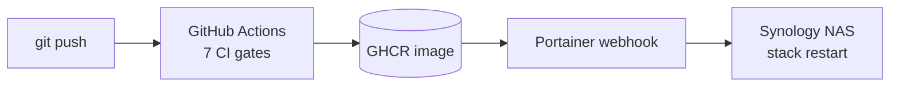

# discord-ollama-bot — a self-hosted AI Discord bot

[](https://github.com/johnhh2/discord-ollama-bot/actions/workflows/ci.yml)
[](https://www.python.org/downloads/)
[](https://github.com/Rapptz/discord.py)
[](docker-compose.yml)
[](LICENSE)

A Discord bot that runs entirely on your own hardware: chat with a local [Ollama](https://ollama.com) LLM — no API keys, no per-token costs, no data leaving your network — plus a full virtual economy, casino games, a chess engine that plays like a human, a shop that spends coins on real Discord effects, and a tiered permission system. Backed by MariaDB, deployed with Docker.

**90+ commands · 1,250+ tests · more test code than source code · zero external AI services**

<!-- TODO: demo GIF or screenshot here — a short clip of !ask streaming + a !slots spin sells this better than any text. -->

## Why this exists

Most AI Discord bots are thin wrappers around a paid API. This one talks to an Ollama instance on your LAN, streams responses as they generate, and throttles concurrent generations with a global semaphore so one GPU can serve a whole server. Everything else — the economy, games, and moderation — works even when the LLM is down (the health endpoint reports "degraded", not dead).

## How it runs


## Features

### 🤖 LLM chat, locally hosted
- `!ask` — conversational Q&A; each conversation gets its own thread with isolated context
- `!continue`, `!tldr`, `!story`, `!roleplay` — follow-ups, summarization, and persona modes
- Per-guild model selection, with separate models per mode (`!model`, `!codingmodel`, `!roleplaymodel`)
- Custom system prompts per guild (`!setprompt`), channel-scoped passive replies, per-user rate limiting via a token bucket
- Streaming output with a global semaphore so a single GPU is never oversubscribed

### ♟️ A chess bot that plays like a human
`!chess @TheBot 1400` (or `!chessbot 1400`) gives you an opponent that actually plays like a 1400 — not a crippled engine that alternates brilliancies and free queens.
A bare `!chessbot` shows your ladder instead: this week's free lottery tickets, your best defeat, first-win bonus progress, and a Play button for the suggested next Elo.

| Requested Elo | Engine behind the board |
|---|---|
| 100–1000 | Maia 1100 blended with calibrated random-move noise |
| 1100–1900 | [Maia](https://maiachess.com) human-trained neural networks (one per 100-Elo bin) via lc0 |
| 2000–3190 | Stockfish at native strength |

Ratings are **Lichess-scale** (Maia is trained on Lichess games at each rating). If you think in chess.com terms, pick ~200–400 higher than your chess.com rating below 2000; the two scales converge above that. The 2000+ tier is approximate — Stockfish's built-in limiter is engine-pool-calibrated — so read those labels as "roughly this strong". Post-game analysis estimates use the same scale.

PvP works too, with SAN/UCI move input, board rendering, threat analysis (`!chessthreats`), and archived games (`!chess view <id>`).

### 🎰 Economy & casino
- `!daily` rewards with streaks (5am CT reset, DST-aware), `!savings` with compounding interest, `!pay`, `!graph` for balance history
- `!assets` real estate — 36 unique bot-wide properties (10k–2m 🪙) paying 1.1% of their price per day, banked automatically with your daily claim, with a cross-server player marketplace (`!assets sell <name> <price>`; lowball listings get an instant 75%-of-value bank buyback offer), one named upgrade per property (+35–75% revenue), and renameable businesses (`!assets rename`)
- `!slots` with a progressive jackpot, `!blackjack`, `!flip`, `!scratchoff`, and a monthly `!lottery` drawn on the 1st of each month at 6pm CT (one 1,000-coin ticket per user per server per day — bought from the dailies-channel 🎟️ button or a `!lottery` confirm prompt — plus up to 2 free tickets a week for beating a 600+ Elo chess bot — a global weekly cap shared across servers)
- Crime layer: `!steal`, `!mug`, `!bankheist` co-op heists, `!jail` / `!bail` / `!jailbreak`, and purchasable insurance
- `!bounty <coins> [duration] <condition>` — escrowed rewards anyone can claim, with author accept/reject via DM and a community-vote contest path
- `!leaderboard`, `!records`, `!economy` server overview
- Optional dailies channel (`!settings dailies-channel`) — a self-cleaning channel with a single "Claim your dailies" embed; reacting 🗓️ instantly claims the daily reward and all scratchoffs (🪙 also coin-flips the whole claim — daily reward + scratchoff winnings — and 🎰 bets it on slots; 🎟️ only buys the day's remaining half-price lottery tickets, without claiming), results auto-delete after 5 minutes (results with 10k+ won or lost stay until the reset), and the claim reactions reset at 5am CT

### 🛒 Shop with real consequences
Coins buy actual Discord effects: nicknames, role creation/colors, channel renames and locks, mutes, mock/curse/ragebait text effects, taxing another user, UNO-reverse cards, and insurance against all of the above. Prices are centrally tuned in [src/config.py](src/config.py).

### 🎮 Games & progression
- `!hangman` (~7.5k-word list, rarity-weighted payouts), `!ttt`, `!c4`, `!race`, `!puzzle`
- Per-guild XP and levels (`!lvl`, `!levels`) with commands gated behind level thresholds

### ⛏️ Minecraft server status
- `!mc` (aliases `!minecraft`, `!mcstatus`) — live Bedrock server status over a RakNet UDP ping: player count, latency, version, server name, gamemode
- Background monitor posts up/down alerts and player-count notices ("a player joined — 3/10 online") to a channel set with `!settings minecraft-channel`
- The bot's presence rotates through active status lines: the Minecraft player count (shown while at least one player is online), today's scratchoff total (shown once more than 3 cards have been scratched since the 5am CT reset), and today's lottery ticket sales (shown once at least one ticket has been bought)
- `!graph minecraft` — server ping over the last 2 weeks as an averaged line with a min/max band: hourly resolution from the ~60s polls of the last 7 days, daily avg/min/max rollups beyond that (kept ~10 years); downtime shows as dips to 0. Daily bars overlay the chart with each day's peak concurrent players, join count, and total player-hours (count-based — the Bedrock pong never carries names; also kept ~10 years)
- Works against any reachable Bedrock endpoint (e.g. an [itzg/minecraft-bedrock-server](https://github.com/itzg/docker-minecraft-bedrock-server) container on the same host) — no docker socket required

### 🛡️ Moderation & administration
- Three-tier permission system (`everyone` / `server_admin` / `bot_admin`) declared in one JSON file, with per-guild user overrides via `!setperm`
- A `hidden` flag makes sensitive admin commands invisible to unauthorized users — denied silently, no error message
- Full audit log of admin actions; Docker-aware `!restart`; `!settings` for per-guild configuration
- Built-in issue tracking: users file `!bugreport` / `!featurerequest` from inside Discord

## Quick start (Docker)

You need: a [Discord bot token](https://discord.com/developers/applications), a MariaDB database (empty is fine), and [Ollama](https://ollama.com) running on the host or another machine on your LAN.

```bash
git clone https://github.com/johnhh2/discord-ollama-bot.git
cd discord-ollama-bot
cp .env.example .env       # fill in DISCORD_TOKEN and DB_* values
docker compose up -d
docker compose logs -f
```

That's it — there is no manual schema step. The bot applies versioned, checksummed [SQL migrations](migrations/) at boot, so a fresh database is initialized automatically and upgrades ship with the code.

### Running locally (without Docker)

```bash
pip install -r requirements.txt
cp .env.example .env
python main.py
```

## Configuration

All configuration is via environment variables — see [.env.example](.env.example) for the full annotated list. Highlights:

| Variable | Default | Description |
|---|---|---|
| `DISCORD_TOKEN` | — | **Required.** Bot token from the Discord Developer Portal |
| `DB_HOST` / `DB_PORT` / `DB_USER` / `DB_PASSWORD` / `DB_NAME` | — | **Required.** MariaDB connection |
| `BOT_ADMIN_IDS` | — | Comma-separated Discord user IDs granted the `bot_admin` tier |
| `OLLAMA_BASE_URL` | `http://host.docker.internal:11434` | Ollama API endpoint |
| `OLLAMA_MODEL` | `dolphin3:8b` | Default model for `!ask` |
| `SYSTEM_PROMPT` | `You are a helpful assistant.` | Default character prompt |
| `HISTORY_LIMIT` | `20` | Per-channel history depth fed to the model |
| `ACTIVE_CHANNEL_IDS` | _(all)_ | Channels where the bot replies passively |
| `DISCORD_CLIENT_ID` | — | Only needed for `!botinvitelink` |
| `MC_SERVER_HOST` | _(disabled)_ | Minecraft Bedrock server address for `!mc` + monitoring. Any reachable endpoint works; prefer the **external** address (DDNS/WAN) so ping reflects the route players take. For a same-host server, `host.docker.internal` also works (local-only latency) |
| `MC_SERVER_PORT` | `19132` | Bedrock UDP port |
| `MC_POLL_SECONDS` | `60` | Monitor poll interval (up/down alerts, player-count notices, presence) |
| `MC_SERVER_SHOW_IP` | `false` | Show the server address in `!mc` embeds and monitor alerts (hidden by default) |

## Engineering highlights

The part of the README for people reading this as a portfolio piece.

**More test code than source code.** ~23k lines of source, ~24k lines of tests, 1,250+ test functions. The suite runs against an in-memory SQLite double that speaks the production MariaDB dialect through a translation layer ([tests/fakes/db.py](tests/fakes/db.py)) and a fake `discord` module — so `pytest` needs no token, no database server, and no Ollama, and finishes fast enough to run on every commit.

**Boot-time schema migrations.** Numbered SQL files with per-file sha256 checksums; the runner refuses to boot on gaps, duplicates, or edited history ([src/migrations.py](src/migrations.py)). The test fake builds its schema from the same migration files, so a migration that only works on MariaDB fails in CI before it ever reaches production. Optional paired `.down.sql` files give operators explicit reverts.

**Concurrency discipline.** Discord users can fire the same command from multiple devices before the first invocation finishes. Every gated command follows a documented claim-synchronously-roll-back-on-failure pattern, and the test suite includes interleaving regression tests that force event-loop yields inside the race window to prove the fix.

**Defense in depth in CI.** Every push runs seven gates: `ruff` lint, `gitleaks` full-history secret scan, `bandit` security lint, `pip-audit --strict` against a hash-pinned lockfile, the full test suite, a container build, and a Trivy image scan ([ci.yml](.github/workflows/ci.yml)).

**Hardened runtime.** The container runs with a read-only filesystem, all capabilities dropped, `no-new-privileges`, and a 512 MB memory cap. A loopback-only `/healthz` distinguishes hard dependencies (Discord, DB → 503) from soft ones (Ollama → 200 "degraded"), and `/metrics` exports Prometheus text format.

**Real production deploys.** Push to `main` → GitHub Actions builds and pushes to GHCR → a Portainer webhook on a Synology NAS pulls and restarts the stack.



## Project structure

```
src/
├── core.py            # Bot factory, extension loading, level-gate check
├── config.py          # All env vars and tunable constants
├── migrations.py      # Checksummed schema-migration runner (runs at boot)
├── persistence/       # MariaDB-backed save/load layer, split by domain
├── db.py              # aiomysql connection pool
├── ai.py              # Ollama streaming, rate limiting, system prompts
├── permissions.py     # Tier resolution, per-guild overrides
├── economy.py         # Balance, daily reset, savings, jail logic
├── health.py          # /healthz + /metrics (loopback-only aiohttp server)
├── events.py          # Message dispatch, XP, text-effect handlers
├── state.py           # In-memory caches loaded at startup
├── cogs/              # 15 command groups (admin, ai, economy, shop, minecraft, …)
├── games/             # Chess (+ engines), blackjack, hangman, ttt/c4, race
└── gambling/          # Slots, flip, scratchoff
migrations/            # Numbered SQL migrations — the schema's source of truth
tests/                 # 1,250+ tests, in-memory DB fake, fake discord module
```

## Running the tests

```bash
pip install pytest pytest-asyncio
pytest            # no token, DB server, or Ollama required
```

Notable suites: concurrency races ([tests/test_economy_flows.py](tests/test_economy_flows.py), [tests/test_shop.py](tests/test_shop.py)), migration ordering and checksums ([tests/test_migrations.py](tests/test_migrations.py)), downtime recovery for missed scheduled events ([tests/test_downtime.py](tests/test_downtime.py)), chess engine integration ([tests/test_chess_bot.py](tests/test_chess_bot.py)), and Minecraft monitor flap suppression ([tests/test_minecraft.py](tests/test_minecraft.py)).

## License

MIT — see [LICENSE](LICENSE).
